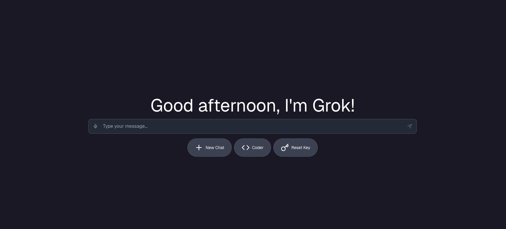

# AI Chat

This was made for the final week of hackclub's #siege event, with 14 weeks (including prep, which was 4 of them)! The app uses hackclub's ai api (ai.hackclub.com), trying out the project requires a key. You can log in with your HackClub account in order to receive an api key. Please be sure to check their rules before use! 

Supported Models:
- Gemini 3 Pro
- Gemini 2.5 Pro
- GPT 5 Mini
- Grok 4.1 Fast
- Kimi K2 0905
and all other models from https://ai.hackclub.com/dashboard too! (see custom model feature)

Features include:
- Streaming
- Chat History (uses localstorage)
- Custom System Prompts
- Coder Feature (makes HTML websites)
& more

## Preview Image

## Preview Site

You can view the site (live preview) at https://chathackclub.vercel.app (You can even use ?model= to set the model, try Gemini or Grok!), the live demo still requires a key.

## Deployment

You can use `npm i` (or pnpm/bun) and then `sudo npm run dev`, to deploy use `vc